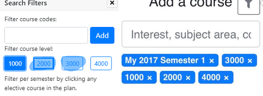
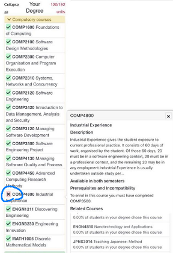
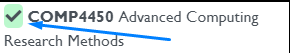
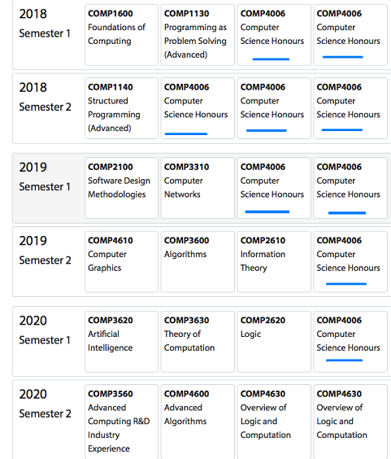
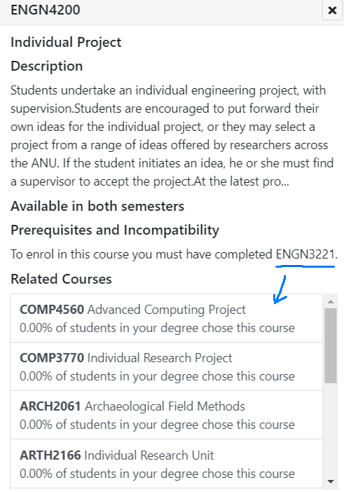
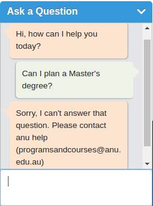
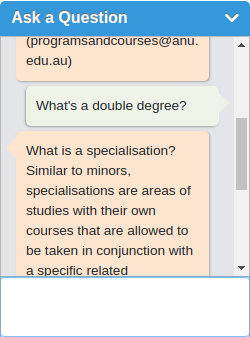

# User Testing Document

**User C** from the College of Business and Economics likes the drag and drop feature, in addition to the checks for course availablity for his desired semester. However, "I can't drag and drop to another unit and swap with it." "The system is letting me repeat the same course over and over again". This is due to a broken commit that was pushed to the repository which was also pushed to the live server. Furthermore, the unsupervised testing shown that the hidden "Reset/Clear" button is a relatively poor design choice as **User C** said that he spent a few minutes trying to find out how to clear the table but ended up not finding it. "I tried using the website on a mobile at first but I couldn't add any courses".

**User G** stated that the website "looks absolutely impressive, but there should be more colors!!" 

**User HH** said that "The input for starting year should just be a selection box, some non-native English speakers like myself may be confused otherwise." "The overall experience is really simple and easy, but the layouts should be revised because sometimes the objects can be all over the place, ocassionally covering the part of the planner itself." "Not bad, ANU should've made something like this lol."

**User HH** from the Research School of Computer Science stated that the filter didn't provide a clear feedback when selecting filters. "They stay **highlighted in blue when you hover over** each category, clicking it creates a small border around the button and adds to the search bar on the left. However, the feedback does not feel strong enough in a sense that I don't really know if the filter was applied unless I carefully looked around. A suggestion for this is that the filters that were selected should remain highlighted in blue, and for every filter there should be a *"Add to Filter List/Apply Filter"* button as a confirmation instead of subtly being added to the list without clearly notifying the user."

"Without instructions, I wouldn't have known what the **X** really meant."

**User I** from the School of Arts said that "the website was generally easy to use and the layout was alright for its purposes." User I appreciates the Q&A feature, but also suggested that the reset button at the top should be at least somewhat visible at all times as it is currently only visible when users hover over that general area.

**User K** encountered a potential issue. "As long as there is a *green* tick from the *"Your Degree"* tab, I was able to add the same course to all available slots in my degree planner over and over again and eventually submit my degree" 

**User K** also suggested adding our university name to the title of the website, but the user interface felt pretty neat and simple and generally easy to use.

**User L** from the Research School of Computer Science mentioned that the drag & drop feature **isn't smooth**; *"If there were no instructions given beforehand, I never would have guessed to drag & drop". Other than that, when I click on a course I was greeted with the course info for that course. However, there was a prerequisite for the course but it **wasn't available** for me to drag & drop under the list of **related courses**"*

**User LL** from the School of Physics and Mathematical Sciences said that her first impression was that the website is pretty easy to use and intuitive. However, "when I drag a course into a cell, that cell should be colored. Courses from differing categories should also be color coded." Color coding is on our backlog but may probably be pushed up the priority queue if more users request for it. Moreover, she suggested that there should be an option to download the finished planner.

**User M** described that the website looks really bland, "there are too much empty spaces, especially the homepage." "The frontpage should include 'ANU' since this is made for our university." "The Ask a Question feature is really cool, but it feels quite intrusive if my browser window is small, if I click on the X it simply disappears, but what if I need to use it later?" This issue was also raised by our clients so it's clear that changes to this can and should be made as soon as possible. "I really like the fact that clicking on a course reveals more details about it as well as related courses though it seemed that the related course section is not entirely accurate which I assume  will improve over time."

**User N** from the School of Physics and Mathematical Sciences said that the navigation felt a little daunting to him.

**User O** raised several findings:
1. "Sometimes I couldn't drag the options in, it just ends up letting me highlight. I don't really know how that happened."
2. "The pop-ups may block some of the cells so u can't drag the units into the cells. "
3. "Sometimes the pop-up suddenly flies to the other side of the screen."

**User OO** absolutely loves the website, "I wish something like this was available when I first started my undergrad degree. It would've made my life so much easier back then." He is a Masters of Computing student and was notified that Postgrad degrees are not available in the current version. He mentioned that he was interested in the "Ask a Question" feature and is keen to see how great can it become when the service is officially released to public. "I'm looking forward to the Postgrad integration, and maybe even a saving/downloading option at some point in the near future."

**User H2** : (unsupervised unedited comments)

*Positives*
Tried the ask a question thing. Really helpful. Though, I find some of the range of questions limiting, (like asking what are some of the features of the website), its still a good function to have. The add filter was a nice touch. It helps find the specific courses you're looking for. I also like the recommendation tab but it currently doesn't do anything. The standout feature, I found, was the add to plan feature a really good concept. It really streamlined the process and opens the student up for courses they don't know about. I also just understood what the 12/24 around the "your degree" section meant. Perhaps including how much unit a course would have (i know its displayed in the programs and course website but i just think it maybe easier. Feel free to discard this comment though)

*Negatives* It seems that the submit degree is not working. On a slight side note, the course details popups are useful but i noticed that they can't be moved or automatically closed. I bring this up since it may cause some screen clutter. This is not  so much as a negative but something I'd like to point out. When I tried it, its not really a problem, but wanted to highlight that is something people can do. But overall, liking how its turning out

**USER T2** : (unsupervised unedited comments)

1. The look and feel of the homepage is very much like Google, **minimalist, uncluttered and simple**. I like that! 😊 Personally, I think that you can remove the **'Home'** button, since clicking on ICS (to its left), also essentially gives the same functionality. But, I understand some users might not notice that.
2. I was tempted to checkout the **Ask a Question** chat, as soon as I saw it, but it didn't really work that well for me. 😝 Maybe I was doing it wrong, or maybe it just needs some more work!

3.	Have you guys tapped into the **CIMS API** to get the programs and courses information, because if you haven't, I certainly think you should have a look at it. It's far better than ANU P&C and unlike the P&C, it actually has an API, which can be very beneficial for you in this project.
4.	Clicking on the **'About'** button gives me a 404! You might wanna fix that. A small suggestion here - Instead of redirecting to the repository, why not just describe the underlying AI (in simple words of course!) to let people know what's going under the hood. It can surely make your product more credible! 😊 
5.	I admit I don't know much about Bachelor's programs since I was a Master's students, and your platform doesn't have any support for Master's programs as of now, so I couldn't really check the validity of the planner. But, I still had fun playing around with the courses! 😊 **The UI looks pretty cool and intuitive!** That's something that we struggled with in our project, so good work with that! Improvement -- Although the functionality is already covered by the **'Remove'** button, it might be better to have a **'X'** on each course tile to remove it from the degree plan. Better UX imho!
6.	I can help with the validity bit if and when you decide to integrate postgraduate degree programs!
7.	Good job including a short description and next offerings of each of the courses! That really helps while planning! I also really liked the **Filter** feature for the Course Search.
8.	Nice work with Register and Login functionalities! They pass some basic SQL injection tests haha! 😝 Although the 'Login Failed' messages might need some revisions. A logical next step would be to enable students to sign-in through ANU LDAP and provide functionality for them to save (multiple) degree plans to their profiles.  

