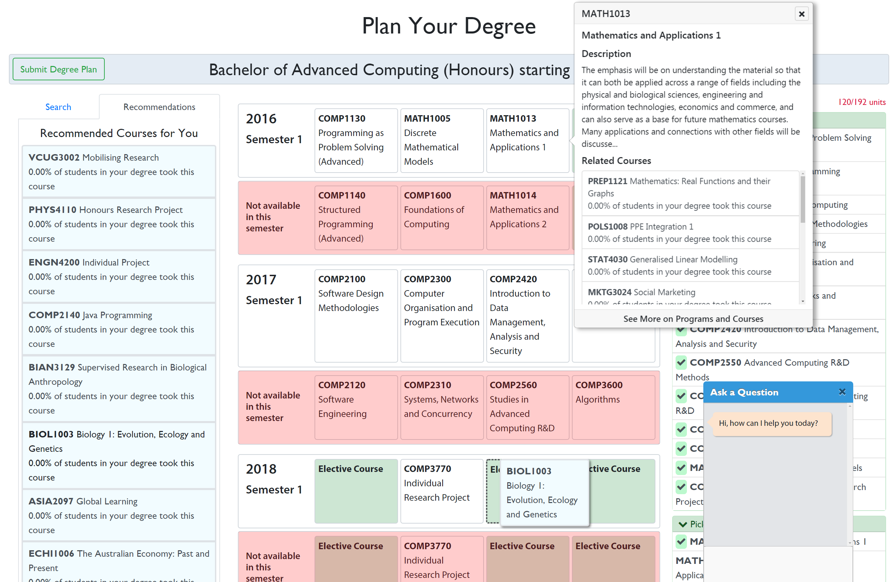
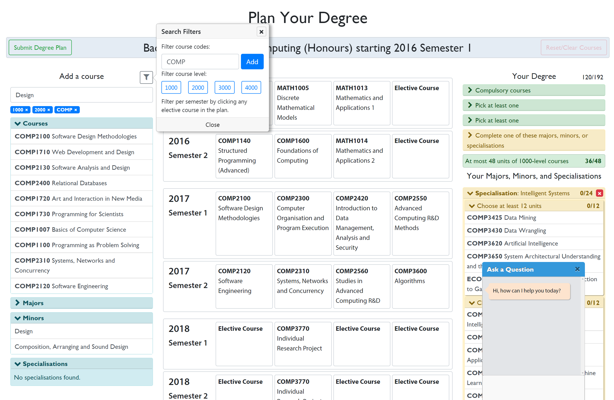
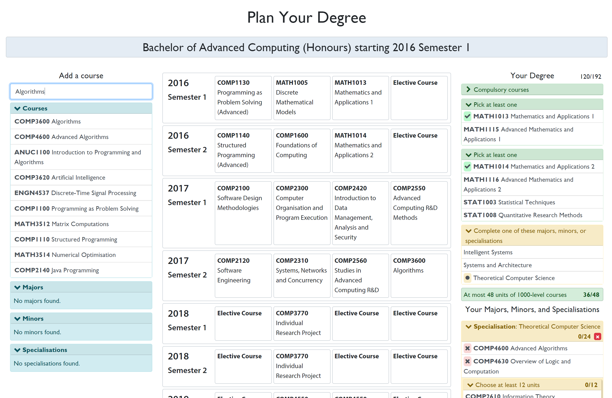
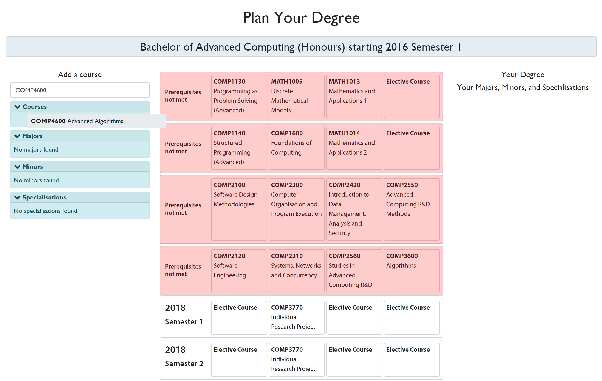
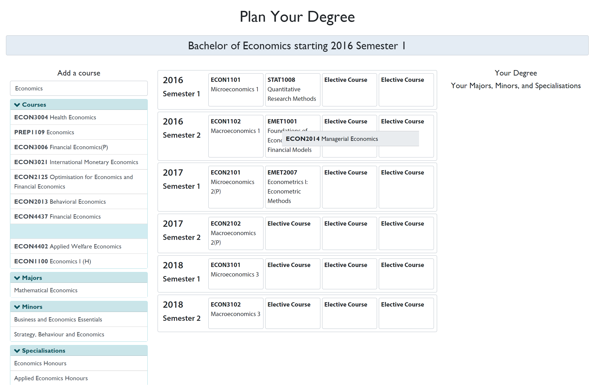
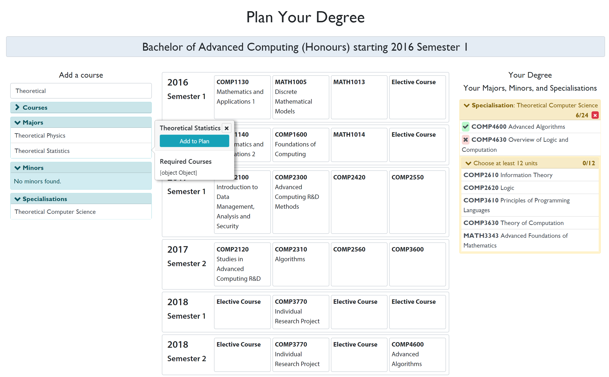
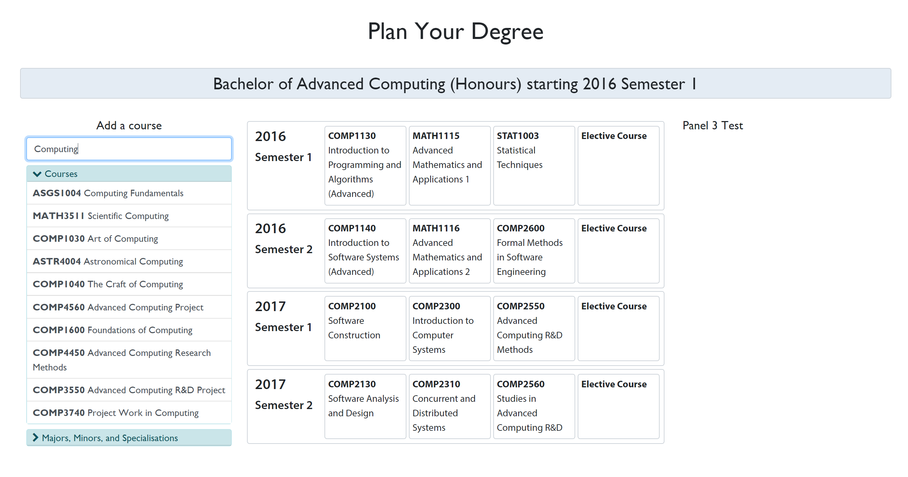
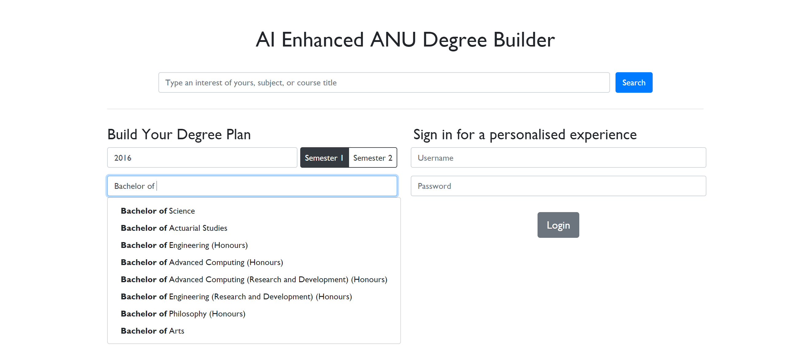
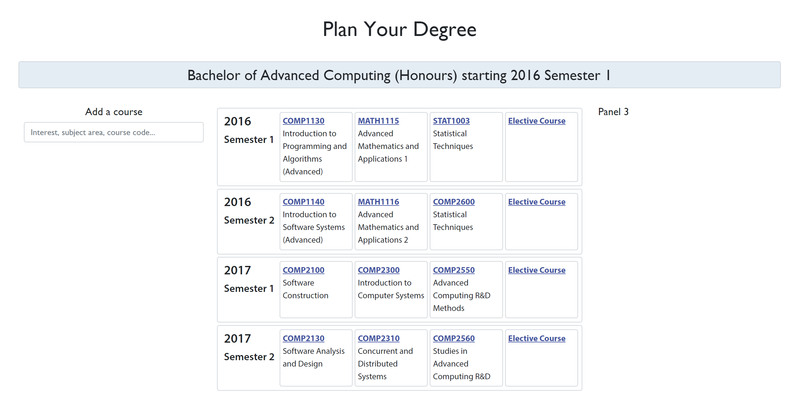

# Project Progress Overview

## Audit 3 / Sprint 10 (Final Sprint)

* [Project Poster](Audit_3/PDF/project_poster.pdf)
* Timeline with Milestones
* Degree planner, final version with course recommendations based on degree and per-course basis:
  
* Degree planner, with ability to filter courses and the Interactive Question and Answer window:
  

## Sprint 9

* Degree planner, with ability to track progress through the current degree:
  
* Degree planner, with ability to indicate to users when course prerequisites are not met:
  
* [Accenture meeting minutes](../Meeting_Minutes/Week_9/week-9-meeting-minutes.md)

## Sprint 8

- Degree planner, with ability to drag-and-drop courses into the automatically generated degree plan:
  
- Degree planner, with ability to search majors, minors, and specialisations, and track the user's progress through them:
  
- [Start of Degree Requirements data collection](https://trello.com/c/oZ38sev4)
- [Interface decisions](Sprint_8/interface.md)
- [Product mock-up complete](Sprint_8/mock-up.md).   

## Sprint 7

* All basic API endpoints complete on server-side. 
* Degree planner, with ability to search all ANU courses:
  
* Front page, with ability to 'suggest' degree names from list of all ANU degrees:
  
* [Accenture meeting minutes](../Meeting_Minutes/Week_7/week-7-meeting-minutes.md)

## Sprint 6

- API Documentation (server-client contract): https://courseai.docs.apiary.io/
- Degree planner, first version:
  
- [Accenture meeting minutes](../Meeting_Minutes/Break/break-minutes-accenture.md)

## Sprint 5

- [Planning Poker](Sprint_5/planning_poker.md)
- [Audit Feedback](Sprint_5/audit_2_feedback.md)
- [Presentation Feedback from Client](Sprint_5/presentation_feedback.md)

## Audit 2 / Sprint 4

* **[Timeline with Milestones](Audit_2/PDF/Schedule_With_Milestones.pdf)**
* **[Audit Presentation](Audit_2/Powerpoint/Audit_Presentation.pptx)**
* [AI Architecture](Audit_2/PDF/AI_Architecture.pdf)
* [User Stories for our Features](Audit_2/user_stories_for_features.md)

## Sprint 3

* [Survey Results and Decision Document](Sprint_3/Documentation/Survey_Result_Documentation.xlsx)
* [Provisional Feature List](Sprint_3/feature_list.md)
* [Accenture meeting minutes](../Meeting_Minutes/Week_5/week-5-minutes-accenture.md)

## Sprint 2

* [Survey Document](https://docs.google.com/document/d/1GjUUUPqve69R3QU9zyt0p_2ZCOwEByfvt-GiPn-2As0/edit?usp=sharing)
  * Take the survey: https://www.surveymonkey.com/r/BcssCAx
* [Results of Academic Program Officer (APO) interview at Fenner Hall](../Data%20Collection/tom-interview-conclusions.md)
* [Main takeaways from Chatbot imitation experiment](../Data%20Collection/Facebook_chatbot_questions.md)
* [Correspondence with ANUSA, PPM, and Evaluations for Survey Deployment](Sprint_2/Email_Correspondence/Survey_Deployment.md)
* [Correspondence with ANU Student Services](Sprint_2/Email_Correspondence/ANU_Student_Services.md)
* [Accenture meeting minutes](../Meeting_Minutes/Week_4/week-4-minutes-accenture.md)

## Audit 1 

* **[Project Charter](../README.md)**
* **[Team Organisation](Audit_1/PDF/Team_Org_Chart.pdf)**
* **[Stakeholders](Audit_1/PDF/Stakeholders.pdf)**
* **[Timeline with Milestones](Audit_1/PDF/Schedule_with_Milestones.pdf)**
* **[Gantt Chart](Audit_1/PDF/Gantt_Chart.pdf)**

* [Accenture meeting minutes](../Meeting_Minutes/Week_3/week-3-minutes-accenture.md)
* [Accenture meeting whiteboard](../Meeting_Minutes/Week_3/week-3-whiteboard-accenture.jpg)
* [Team meeting minutes](../Meeting_Minutes/Week_3/week-3-minutes-team.md)