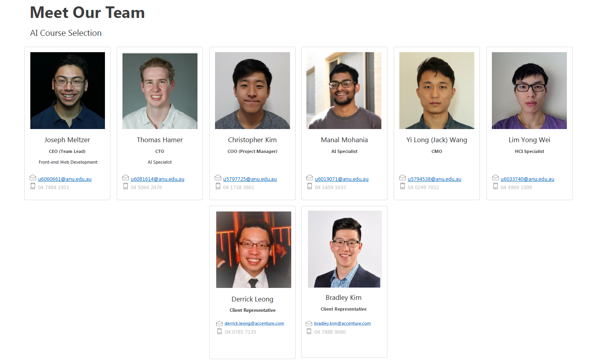
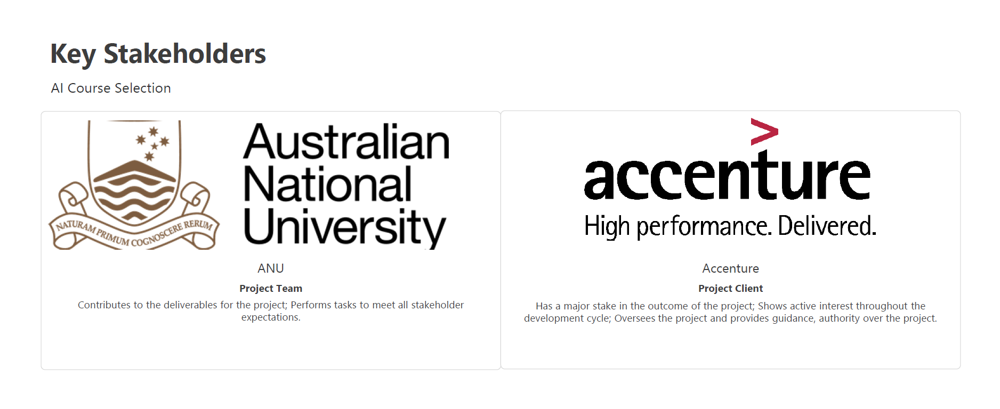
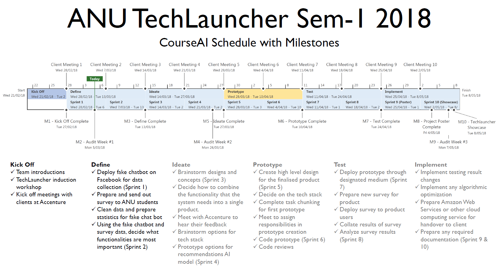

# AI Course Selection
Personalised course discovery experience that employs AI. Students can interact with a digital persona for personalised course information and selection support, completing transactions including enrolling in a course, selecting subjects and scheduling classes.

## Table of Contents
   1. [Meet our Team](#meet-our-team)
   2. [Client's Vision](#clients-vision)
   3. [Key Stakeholders](#key-stakeholders)
   4. [Client and Stakeholder Expectations](#client-and-stakeholder-expectations)
   5. [Project Impact](#project-impact)
   6. [Project Milestones, Scheduling and Deliverables](#project-milestones-scheduling-and-deliverables)
   7. [Technical and Other Constraints](#technical-and-other-constraints)
   8. [Resources, Risks and Potential Costs](#resources-risks-and-potential-costs)
   9. [NDA and IP Concerns](#nda-and-ip-concerns)
   10. [Tooling](#tooling)

## [Meet our Team](PDF/Team_Org_Chart.pdf)

## Client's Vision
Vision: Empowering University Students to get the most out of their studies, through optimisation of course selection and scheduling.

Our project recommendation is to complete a proof of concept (POC) for a personalised course discovery experience employing Artificial Intelligence. Prospective or existing students would be able to interact with a digital persona for personalised course information and selection support, completing transactions including enrolling in a course, selecting subjects and scheduling classes.

This proof of concept matters because the university:
*   continually needs to improve its services to reinforce its position as a leading university, while differentiating itself by demonstrating its focus on innovation and technology
*   wants to make it as easy as possible for qualified students to select the right courses for them and become enduring members of the university’s community
*   wishes to provide great experiences to its prospective and existing students that build their continued engagement with the university.

## [Key Stakeholders](PDF/Stakeholders.pdf)

## Client and Stakeholder Expectations:
* Accenture
  * Demonstrate the value of using Artificial Intelligence systems.
* The Australian National University
  * Demonstrate the value of using Artificial Intelligence systems.
  * The team will meet all project deliverables within the schedule. 
  * Eventually demonstrate that this proof of concept is a viable solution for tertiary students to effortlessly engage in course selection and scheduling. 

## Project Impact
The aim of this project is to simplify the course selection process for university students. AI technology, particularly that which is related to interactive agents (chatbots) and recommendation generation, has recently seen substantial improvements – such as Amazon’s Alexa, and Google’s use of Word2Vec in their search product. Integration of this technology into student course selection is an innovative and interactive way for university students to retrieve information about available programs and courses. Further, we believe it will work for students to enhance the process of constructing their degree program with courses that both satisfy their degree and meet their interests. These goals can be condensed into three key benefits of the project outcome. 
1. Students will be able to obtain accurate information about courses they have not yet studied in a user friendly and simplified manner. The use of AI technology in user interaction will assist users in exploring the exact information that they need and reduce unnecessary time spent mining information. This largely reduces the difficulties of information exploration and reduces laborious and repetitive work.
2. AI course scheduling can operate as a digital assistant for students with their courses, which would conserve human resources for university departments. It could interact with students at any time without the use of an actual human advisor and would answer course-related questions quickly. 
3. We believe that this project will encourage students to explore more about courses and enable students to consider a greater number of options when enrolling. As a result, the proposed project would enhance student experience and university life.

## Project Milestones, Scheduling and Deliverables
### Milestones at a glance
1. 27th Feb - Kick Off
2. 5th  Mar - Finalise documents for the Audit Landing Page
3. 13th Mar - Complete the Define stage
4. 19th Mar - Prepare for Audit 2
5. 27th Mar - Complete the Ideate stage
6. 10th Apr - Complete the prototype
7. 24th Apr - Complete the testing process
8. 30th Apr - Prepare for Audit 3
9. 4th  May -  Complete project poster
10. 8th  May - TechLauncher Showcase  

### [Project Timeline](PDF/Schedule_with_Milestones.pdf)

### [Gantt Chart of Tasks](PDF/Gantt_Chart.pdf)

## Technical and Other Constraints
Our primary limitations and technical constraints are (1) the quality or availability of our course and degree requirements data, (2) the quality of software which we can use for our interactive agent (chatbot) (3) the capabilities of the recommendation model that we create, which will depend on the AI technology that is available to us. *Note that some of the technologies and have not been completely committed to, and may change throughout the ideate and define phases (see schedule).*

### Course/degree requirements data
Data on course/degree requirements will allow our AI to provide accurate recommendations for courses based on prerequisites, required knowledge and degree program structures. There are two key options for accessing this data. The ideal situation is that we will be able to access the data on ISIS, where it is used in ANU’s administration software. We have undertaken steps to gain access to the ISIS database, and are awaiting approval to go ahead. If this is not possible, we have also discussed the possibility of web-scraping course data from the ANU “Programs and Courses” website.

ISIS data limitations:
-   The ISIS database may not contain all of the data that we require, in which case our AI could be limited to only recommending for certain programs and courses.
-   We may need to scrape additional data from the ANU Programs and Courses website.

Web-scraping limitations:
-   Some courses have complex requirements such as requiring one course from a certain group of courses, or that the student is in a particular year of their university studies. This may require us to encode complex rules and process the requirements with natural language processing technology. While our team has members experienced in NLP, the arbitrary complexity of these requirements could prove to be a major issue.

### Amazon Lex
Amazon Web Services’ customisable chatbot product “Amazon Lex” is being considered as an option for the creation of our chatbot. As it stands it is one of the better choices, especially given that some members of our team already have a good understanding of the documentation and capabilities of this product.

Key limitations:
-   Lex does not support integration with Google, Viber, Twitter or Skype. [1]
-   Lex does not support explicit context switching. This means that once it perceives the user to have a certain intent, it will not change without being explicitly informed.
-   For the first year, Lex allows users to process up to 10,000 text requests and 5,000 speech requests per month for free. Following this first year, the pricing is $.00075 per text request. [2]

Security:
-   Lex will store data from conversations automatically. Since the user identities are not matched with the conversations and AWS provides security, we do not believe that storing this data is a legitimate security risk.

Reliability:
-   Amazon Web Services has a great reputation for providing reliable products [3]. Amazon, being one of the largest organisations worldwide has AWS well protected from potential server failures.

### Recommendation model generation
Our model will require some form of recommendation algorithm, which is highly dependent on existing technology. Current Natural Language Processing techniques have found use in recommendation software, including advertising and search engine recommendations. However, they are still relatively limited in their effectiveness.

Limitations:
-   Many techniques still rely on models such as the TF-IDF transform, which do not preserve full meaning, as they do not preserve the order of the words in text.
-   More advanced models such as doc2vec often have issues with weighting too heavily on irrelevant parts of documents

Reliability:
-   We must ensure that there is an algorithmic recommendation option we can provide given that the AI model fails.
-   If both options fail often, the model will provide inaccurate and unreliable predictions.

## Resources, Risks and Potential Costs
**Risk** Chatbot technology is not at a sufficient standard to create a useful course selection AI.  
**How we will manage this risk:**
If the chatbot technology we use is not sufficient, we will likely move to a more structured question and answer session. Each user would only need to complete this question and answer session once, and the session would result in the creation of a profile for the user, which would store their degree program, interests and other personalised data.

**Risk** The ANU ISIS database is not made available for us to access course requirements.  
**How we will manage this risk:**
This was discussed above, however, it is important to note that if we are not able to access the ISIS data, we will need to assign an additional responsibility of creating a web scraper to one of our developers. This is relatively costly as the developer will therefore have substantially less time to contribute to other parts of our project, and the data gathered may be of a poorer quality.

**Potential cost: Amazon Web Services**  
Should we decide on using AWS’ Lex chatbot service, our best option would be to deploy our other required backend code on AWS as well. Aside from the aforementioned cost of Amazon Lex, deployment of our backend service and web page will also incur costs. AWS provides a free tier for the first year of use of its EC2 virtual machine product, which is a leading candidate for the deployment of our service.  
The ideal situation would be that the free tier of AWS Lex and EC2 would provide us with enough functionality to last through the testing and development phases. The finished product would then be handed on to the client, who would then pay any costs incurred from use of AWS.  
Exact costs for EC2 and AWS can be calculated when we have a more accurate understanding of the specifications of our virtual machine - that is, the required disk space, memory, CPU cores etc.

## NDA and IP Concerns
There will be no non-disclosure agreement required.

Any materials, tools, methods/techniques and software provided by Accenture and/or advised and agreed to be Accenture Copyright, will remain the intellectual property of Accenture. 

## Tooling
Team communications: Slack channel "AI Course Selection": http://courseai.slack.com/

Task management:
- Trello team "AI Course Selection": https://trello.com/aicourseselection
- Trello board "Tasks": https:/trello.com/b/QAxPOMSr/tasks

Project repository:
- GitHub repository "courseai": https://github.com/AICourseSelection/courseai
- GitHub organisation "AICourseSelection" https://github.com/AICourseSelection

## References
 1. J. Singh. Google API.AI and Amazon Lex - A comparative review (2017).  
 https://www.linkedin.com/pulse/google-apiai-amazon-lex-comparative-review-jaskaran-singh/
 2. Amazon Lex Pricing.  
 https://aws.amazon.com/lex/pricing/
 3. B Darrow. Amazon Web Services tops list of most reliable public clouds. (2015)  
 https://gigaom.com/2015/01/07/amazon-web-services-tops-list-of-most-reliable-public-clouds/
