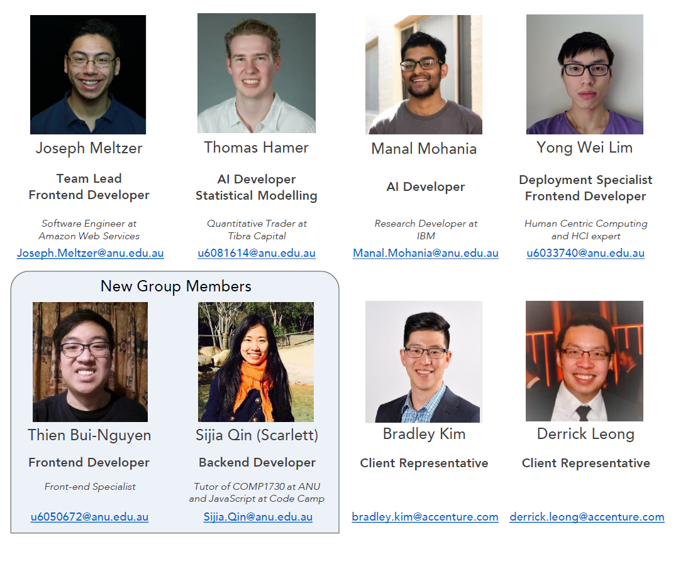

# AI Course Selection
A personalised course discovery experience that employs AI. Students can interact with a digital persona for personalised course information and selection support, completing transactions including enrolling in a course, selecting subjects and scheduling classes.

The Intelligent Course Scheduler is live! Try it out at http://www.anuics.com

### [Semester 2 Project Progress](Documentation/Semester_2/overview.md)

#### [Semester 1 Project Progress](Documentation/Semester_1/overview.md)

These are overviews of the artifacts we have produced, organised by sprint and audit. They contain quick access to our outputs, documentation, and meeting notes. 

## Table of Contents

1. [Team Members](#team-members)

2. [Tools and Services](#tools-and-services)

3. [Milestones](#semester-2-milestones)

4. [Project Schedule](#semester-2-project-schedule)

5. [Process Changes](#semester-2-process-changes)

6. [Client's Vision](#clients-vision)

7. [Key Stakeholders](#key-stakeholders)

8. [Client and Stakeholder Expectations](#client-and-stakeholder-expectations)

9. [Project Impact](#project-impact)

10. [Technical and Other Constraints](#technical-and-other-constraints)

11. [Resources, Risks and Potential Costs](#resources-risks-and-potential-costs)

12. [NDA and IP Concerns](#nda-and-ip-concerns)

13. [References](#references)

## [Team Members](Documentation/Semester_2/Sprint_1/PDF/Team_Members.pdf)

## Tools and Services
**Team communications**: Slack channel "AI Course Selection": http://courseai.slack.com/

**Project repository**: GitHub repository "courseai": https://github.com/AICourseSelection/courseai

**Task management**: Trello board "Tasks - Sem 2": https://trello.com/b/lNhn5e9R/tasks-sem-2

Related links:

- GitHub organisation "AICourseSelection" https://github.com/AICourseSelection
- Trello board "Tasks" (Semester 1): https://trello.com/b/QAxPOMSr/tasks
- Trello team "AI Course Selection": https://trello.com/aicourseselection

## Semester 2 Milestones

The plan for this semester includes five main work objectives. They are, in a rough order of priority, as follows:

1. **Deployment of the Service**: The Intelligent Course Scheduler (ICS) is to be deployed on a web server and made available for public use - all students and interested parties. This will allow us to conduct controlled and/or mass user testing at regular intervals during the development process. 
2. **Reduce Technical Debt**: Convert the ICS data model to one which takes advantage of the ANU's official source of data regarding all degree programs, majors, and courses. Eliminate bugs in the current system and refactor code for extensibility. Github Issues will be used to keep track of these. 
3. **Persistent Experience**: Allow users of the ICS to leave and come back to their session at a later time, track multiple plans, and export them to other formats. A follow-up goal is to connect to the ANU enrollments database to help automatically generate personalised degree plans. 
4. **Extend Degree Builder Functionality**: Implement additional features of the ICS to encompass a wider user base, allow more flexibility and increase ease of use. Features include Flexible Double Degrees, awareness of changing requirements, and improved metrics, among others. 
5. **Automated Question and Answer**: Improve upon the existing question and answer service, aiming to answer a much broader variety and larger number of potential questions about both the service and degree scheduling. 

For some of these objectives, such as #5, certain aspects within are not yet well-defined. Part of our time will be dedicated to 'research' tasks aimed at determining the feasibility and work involved in completing these tasks. The team has enough skill and diversity therein to support one or two members conducting research for part of a sprint. 

## [Semester 2 Project Schedule](Documentation/Semester_2/Sprint_0/PDF/Schedule.pdf)

* **Kick-Off**: Weeks 1 - 2. Team member recruitment, onboarding, project definition and setup. 
* **Sprint 1**: Weeks 3 - 5. Project Audit 1, Deployment, Reduction of Technical Debt. 
  * Includes first round of user testing which immediately follows deployment. 
* **Sprint 2**: Weeks 6 - teaching break 2. Project Audit 2, and further objectives. 
  * Includes second round of user testing at the midpoint. 
* **Sprint 3**: Weeks 7 - 10. Completion of remaining objectives. 
  * Includes public user testing round at the beginning of week 7, and fourth testing round in week 9. 

## Semester 2 Process Changes

We aim to improve upon the design and development process from last semester in a number of ways. 

* **Longer Sprints**: We are increasing sprint times to three weeks each: allowing for better planning in each, as well as more flexibility. Each sprint will have a mid-sprint review and a retrospective. See the [schedule](Documentation/Semester_2/Sprint_0/PDF/Schedule.pdf). 

* **Regular User Testing**: We will conduct user testing at regular intervals during the development process. These sessions are scheduled for:

  1. Mid-sprint 1: 17/08 - 22/08
  2. Mid-sprint 2: 5/09 - 10/09
  3. End of sprint 2: 17/09 - 23/09 (public and open testing session)
  4. End of sprint 3: 3/10 - 6/10

  Three of these sessions will be with a small group of testers who will be re-used throughout the project.  One session (currently planned to be the 3rd session) will be open to the public and feedback channels will be available to anyone using the system. This allows us to receive a mix of both fresh and experienced opinions regarding our system. 

  Testing operations will be logged using [this template](Documentation/Semester_2/Sprint_0/Test_Template.docx) provided by Accenture. 

* **Clear Representation of Tasks**: Every work task will either :
  1. be well-defined and following the [S.M.A.R.T. criteria](https://en.wikipedia.org/wiki/SMART_criteria), or
  2. be a research task, with the goal of resolving the situation to create tasks of the first type.

  Research tasks will be created in a controlled fashion, so as to constitute no more than 20% of the team's efforts for any significant amount of time. 

* **Gated Check-in**: All significant or new contributions to the codebase will go through a code review process by at least one other team member. This will help with working towards objective #2 - Reduce Technical Debt. 

## Technical and Other Constraints

### Course/degree requirements data

Data on course/degree requirements will allow our AI to provide accurate recommendations for courses based on prerequisites, required knowledge and degree program structures. This data is quite complex, with many facets and links between different parts. We have obtained the data thus far by scraping the Programs and Courses website, combined with some manual entry of the requirements for 20/60 of the current undergraduate degree programs. With the expansion of scope to all years and all degrees, this process will need to be automated. Programs and Courses has an API which we will endeavor to use to avoid scraping. 

However, whatever form the data is obtained in, it still needs to be parsed and interpreted into a concrete data model. The data model is very complex, as degrees, majors, and courses have many requirements and some are complicated to understand, even as a human, very diverse in their scope, and sometimes incorrect or not even listed. Some courses or degrees are such that their requirements are inconsistent all by themselves. It is likely that may be some particular rules or constraints that we will be unable to capture from the data that is currently available. 

## Resources, Risks and Potential Costs

**Risk:** The Degree/Major/Course information structure is too complex for us to capture in a good or efficient data model. 

**How we will manage this risk:**
We already have a reasonable data model which can capture a majority of degree/course requirements. The extent of the data complexity will be thoroughly analysed, and a compromise will be made between completeness and: 1) the feasibility of capturing said data, 2) the efficiency of the data model, and 3) the specificity of the data model. 

**Potential cost: Deployment**  
We are currently investigating different options for deployment of our web service. There are a number of components involved, including Django, Elasticsearch, and a persistent database. We will consider "free options" such as the AWS Free Tier and use them as trials for the service. Exact costs from deployment can be calculated once we have chosen a host. Current specifications for server requirements are listed at https://trello.com/c/FB4tAwm9/4-deployment-investigate-possible-options-for-deployment. 

**Risk:** Chatbot technology is not at a sufficient standard for us to improve upon the existing Question and Answer features.  
**How we will manage this risk:**
If the chatbot technology we use is not sufficient, we may attempt to use a more structured question and answer session, or focus our efforts on one of the other four main objectives for this semester. 

**Risk:** The ANU Programs and Courses database is not made available for us to access course requirements.  
**How we will manage this risk:**
This was discussed above, however, it is important to note that if we are not able to access the ISIS data, we will need to assign an additional responsibility of creating a web scraper to one of our developers. This is relatively costly as the developer will therefore have substantially less time to contribute to other parts of our project, and the data gathered may be of a poorer quality.

## Client's Vision

Vision: Empowering University Students to get the most out of their studies, through optimisation of course selection and scheduling.

Our project recommendation is to complete a proof of concept (POC) for a personalised course discovery experience employing Artificial Intelligence. Prospective or existing students would be able to interact with a digital persona for personalised course information and selection support, completing transactions including enrolling in a course, selecting subjects and scheduling classes.

This proof of concept matters because the university:
*   continually needs to improve its services to reinforce its position as a leading university, while differentiating itself by demonstrating its focus on innovation and technology
*   wants to make it as easy as possible for qualified students to select the right courses for them and become enduring members of the university’s community
*   wishes to provide great experiences to its prospective and existing students that build their continued engagement with the university.

## [Key Stakeholders](Documentation/Audit_1/PDF/Stakeholders.pdf)

## Client and Stakeholder Expectations:
* Accenture
  * Demonstrate the value of using Artificial Intelligence systems.
* The Australian National University
  * Demonstrate the value of using Artificial Intelligence systems.
  * The team will meet all project deliverables within the schedule. 
  * Eventually demonstrate that this proof of concept is a viable solution for tertiary students to effortlessly engage in course selection and scheduling. 

## Project Impact
The aim of this project is to simplify the course selection process for university students. AI technology, particularly that which is related to interactive agents (chatbots) and recommendation generation, has recently seen substantial improvements – such as Amazon’s Alexa, and Google’s use of Word2Vec in their search product. Integration of this technology into student course selection is an innovative and interactive way for university students to retrieve information about available programs and courses. Further, we believe it will work for students to enhance the process of constructing their degree program with courses that both satisfy their degree and meet their interests. These goals can be condensed into three key benefits of the project outcome. 
1. Students will be able to obtain accurate information about courses they have not yet studied in a user friendly and simplified manner. The use of AI technology in user interaction will assist users in exploring the exact information that they need and reduce unnecessary time spent mining information. This largely reduces the difficulties of information exploration and reduces laborious and repetitive work.
2. AI course scheduling can operate as a digital assistant for students with their courses, which would conserve human resources for university departments. It could interact with students at any time without the use of an actual human advisor and would answer course-related questions quickly. 
3. We believe that this project will encourage students to explore more about courses and enable students to consider a greater number of options when enrolling. As a result, the proposed project would enhance student experience and university life.

## NDA and IP Concerns
There will be no non-disclosure agreement required.

Any materials, tools, methods/techniques and software provided by Accenture and/or advised and agreed to be Accenture Copyright, will remain the intellectual property of Accenture. 

## References
 1. J. Singh. Google API.AI and Amazon Lex - A comparative review (2017).  
 https://www.linkedin.com/pulse/google-apiai-amazon-lex-comparative-review-jaskaran-singh/
 2. Amazon Lex Pricing.  
 https://aws.amazon.com/lex/pricing/
 3. B Darrow. Amazon Web Services tops list of most reliable public clouds. (2015)  
 https://gigaom.com/2015/01/07/amazon-web-services-tops-list-of-most-reliable-public-clouds/

